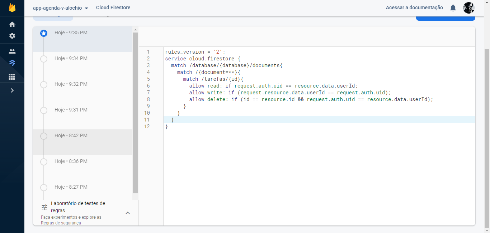
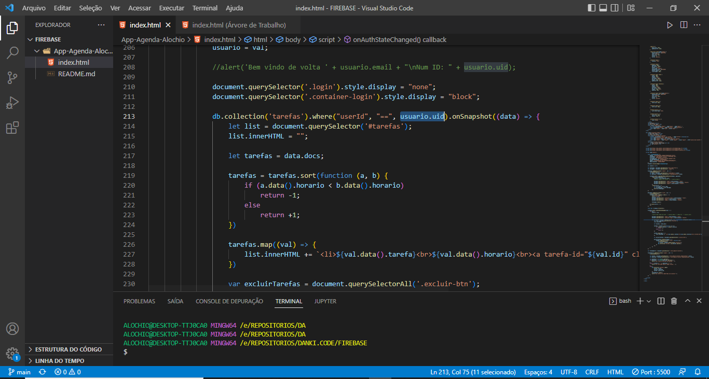

# YourNotes

O YourNotes é um app de agenda, desenvolvido por mim, no acompanhamento do curso de Firebase da Danki Code.

Para o desenvolvimento do app, utilizamos as seguintes tecnologias: 
    -HTML, 
    -CSS, 
    -JavaScript. 

O intuito desse app era melhorar minhas ablidades com as tecnologias citadas acima, e também o conhecimento dessa poderosa ferramente, o Firebase. Onde o banco de dados e as regras de seguranças foram desenvolvidas no mesmo.

Link para acessar o app: (app ainda não publicado).

# INTERFACE DO APP:

	

 

	

 

	

 

# INFORMAÇÕES CONTIDAS NO FIRESTORE - BANCO DE DADOS DO FIREBASE

	

 

	

 

# ANALIZE DE SEGURANÇA DO APP:

Para testar a segurança do app, pegamos o uid de um segundo usuário, e o inserimos no código fonte do programa, pelo próprio VS Code, o observando a tela e também o console do navegador, conseguimos observar que o usuário só consegue vizualizar e editar as informações contidas no banco caso esteja logado com o uid respectivo as tarefas.

A imagem a baixo mostra as regras de segurança colocadas no app.

	

 

	

 

	

 

	

 

	

 

	

 